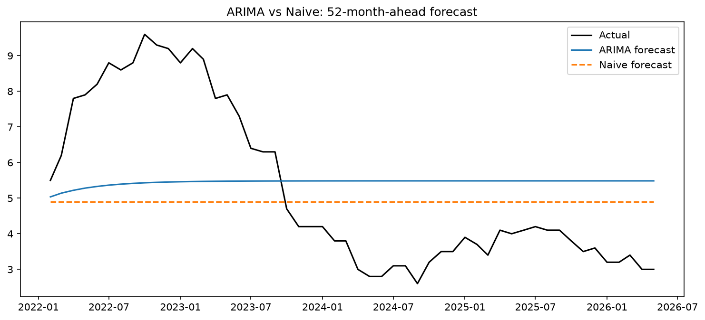
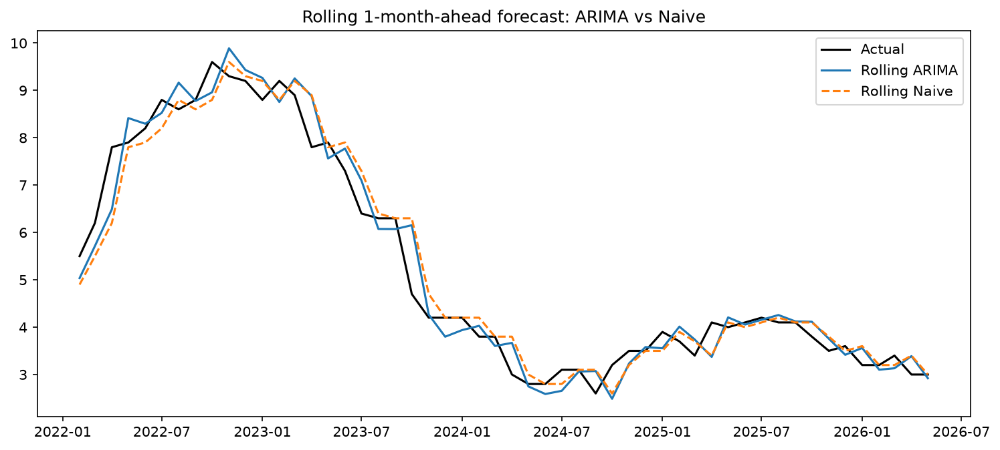

# UK CPIH Inflation Forecasting
Forecasting UK CPIH annual inflation using ARIMA, benchmarked against a naive 
forecast, with both a static long-horizon test and a rolling one-month-ahead 
evaluation.

## Headline result
- **52-month-ahead forecast**: ARIMA did not beat naive (RMSE 2.322 vs 2.308). 
  Both forecasts flattened out and missed the 2022 energy price shock entirely.
- **Rolling 1-month-ahead forecast**: ARIMA achieved a lower RMSE than naive 
  (0.475 vs 0.506), though naive was marginally better on MAE — suggesting 
  ARIMA is better at avoiding large misses, at a small cost in typical months.

## Charts

**52-month-ahead forecast (ARIMA does not beat naive):**


**Rolling 1-month-ahead forecast (ARIMA achieves lower RMSE):**


See [`docs/methodology.md`](docs/methodology.md) for full details, including 
model selection, stationarity testing, and evaluation methodology.

## Data
UK CPIH Annual Rate (ONS series L55O), January 2005–present. Earlier data 
(1989–2004) excluded as ONS flags it as lower-quality modelled estimates.

## How to reproduce
1. Clone this repo
2. Create a virtual environment and run `pip install -r requirements.txt`
3. Open `notebooks/01_exploration.ipynb` and run all cells

## Project structure

```
data/raw          - original ONS CSV
notebooks/        - main analysis notebook
results/figures/  - saved plots
docs/             - full methodology write-up
```

## Limitations
- ACF/PACF analysis showed a seasonal pattern (spikes at lag 12/24) not 
  captured by plain ARIMA — a natural next step would be SARIMA
- Test period for the 52-month evaluation coincides with the 2022 energy 
  shock, likely overstating error relative to calmer periods


